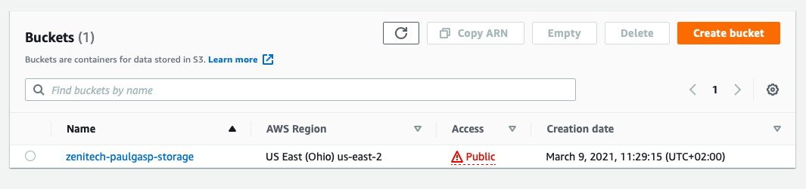

# Zenitech DevOps Internship Project
In this project, we will be using Ansible to automate the deployment of an AWS S3 storage bucket and configure an already created E2 instance to serve static content from the S3 to the web.
## Tasks
- Create an AWS account
- Create an S3 bucket
- Upload `index.html` with any content to S3 bucket
- Create a public EC2 instance

## To start

### Launch E2 instance
Tutorial on how to launch AWS E2 instance can be found [here](https://docs.aws.amazon.com/quickstarts/latest/vmlaunch/step-1-launch-instance.html).

For this tutorial, the information of created E2 instance can be found below.
| **Instance type** |  **vCPUs**  | **Memory (GiB)** | **Instance Storage (GB)** | **Network Performance** |
|:-----|:--------:|------:|------:|------:|
| t2.small   | 1 | 2 | EBS only | Low to Moderate |

After the instalation, the E2 console should look something like this:


### Install Ansible on host machine
Tutorial on how to install Ansible can be found [here](https://docs.ansible.com/ansible/latest/installation_guide/intro_installation.html).

## Configuration
### Define host
For Ansible playbook to execute successfully, `inventory.ini` in `hosts` directory should be modified.

```
[vm]
<IP address> ansible_connection=ssh ansible_user=ubuntu ansible_ssh_private_key_file=<path to AWS private key>
```

You can test your connection using the following command
```ansible -i hosts/inventory.ini vm -m ping```

### Define variables
The variables in `secrets.yaml` file must be modified with required values. For demonstration purposes, the information is provided of an already created IAM user.
```
AWS_ACCESS_KEY: CHANGEME
AWS_SECRET_KEY: CHANGEME
BUCKET_NAME: CHANGEME
AWS_REGION: us-east-2
LOCAL_FILES_PATH: CHANGEME
```

## Run ansible playbook
The ansible playbook can be executed with the following command:

```
ansible-playbook -i hosts/inventory.ini main.yml -vvv -e 'ansible_python_interpreter=/usr/bin/python3'
```

After the command wasexecuted successfully, inside a S3 console, a new storage bucket should have been created.




Inside the storage bucket, two `html` files should have been uploaded.


__Note!__ Check that ansible playbook has allowed a public access to the contents of the S3 storage bucket. It must look as in the figure below:


## Congratulations! 
Your E2 instance is now taking an `index.html` and `error.html` files from created S3 storage bucket and serving a static content on the web. You can open published `index.html` file by visiting the [link](http://zenitech-paulgasp-storage.s3-website.us-east-2.amazonaws.com/).
